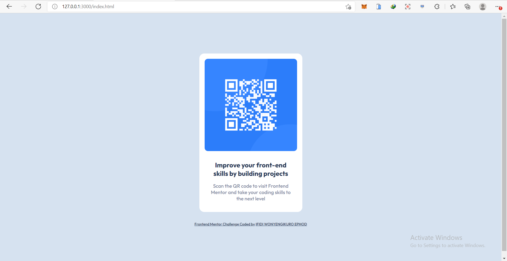
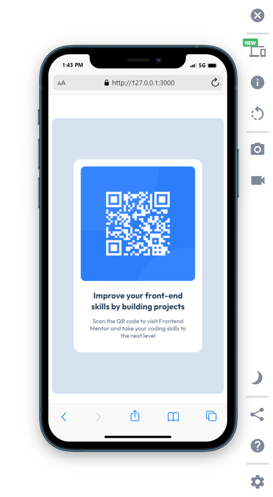

# Frontend Mentor - QR code component solution

This is a solution to the [QR code component challenge on Frontend Mentor](https://www.frontendmentor.io/challenges/qr-code-component-iux_sIO_H). Frontend Mentor challenges help you improve your coding skills by building realistic projects.

## Table of contents

- [Overview](#overview)
  - [Screenshot](#screenshot)
  - [Links](#links)
- [My process](#my-process)
  - [Built with](#built-with)
  - [What I learned](#what-i-learned)
  - [Continued development](#continued-development)
  - [Useful resources](#useful-resources)
- [Author](#author)
- [Acknowledgments](#acknowledgments)

**Note: Delete this note and update the table of contents based on what sections you keep.**

## Overview

This is a design of a QR-Scan for Mobile and Desktop view.

### Screenshot





**Note: Delete this note and the paragraphs above when you add your screenshot. If you prefer not to add a screenshot, feel free to remove this entire section.**

### Links

- Solution URL: [Add solution URL here](https://github.com/winsofttutorials/qr-code-component-main.git)
- Live Site URL: [Add live site URL here](https://winsofttutorials.github.io/qr-code-component/)

## My process

### Built with

- Semantic HTML5 markup
- CSS custom properties
- Flexbox
- CSS Grid
- Mobile-first workflow
- [React](https://reactjs.org/) - JS library
- [Next.js](https://nextjs.org/) - React framework
- [Styled Components](https://styled-components.com/) - For styles

**Note: These are just examples. Delete this note and replace the list above with your own choices**

### What I learned

I learnt some cool stuffs on building this design like, color setup and also using the css flexbox property

To see how you can add code snippets, see below:

```html
<h1>Some HTML code I'm proud of</h1>
```

```css
.proud-of-this-css {
  color: papayawhip;
}
```

```js
const proudOfThisFunc = () => {
  console.log("🎉");
};
```

If you want more help with writing markdown, we'd recommend checking out [The Markdown Guide](https://www.markdownguide.org/) to learn more.

**Note: Delete this note and the content within this section and replace with your own learnings.**

### Continued development

I will continue developing on responsive designs in other to make my designs mor responsive on all screens

**Note: Delete this note and the content within this section and replace with your own plans for continued development.**

### Useful resources

**Note: Delete this note and replace the list above with resources that helped you during the challenge. These could come in handy for anyone viewing your solution or for yourself when you look back on this project in the future.**

## Author

- Website - [Ifidi Wonyengikuro Ephod](https://winsofttutorials.github.io/qr-code-component-main/)
- Frontend Mentor - [@winsoftutorials](https://www.frontendmentor.io/profile/winsoftutorials)
- Twitter - [@ifidikuroephod](https://www.twitter.com/ifidikuroephod)

**Note: Delete this note and add/remove/edit lines above based on what links you'd like to share.**

## Acknowledgments

I would like to thank frontendmentor for this challenge, I know its going to give me the ability to shaping my skills

**Note: Delete this note and edit this section's content as necessary. If you completed this challenge by yourself, feel free to delete this section entirely.**
